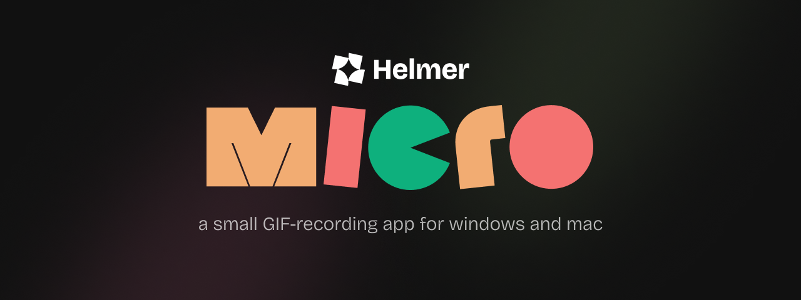

# Helmer Micro

Helmer Micro is a commercial open source (COSS) cross-platform GIF recorder. It is written in Typescript and Rust, using the awesome desktop app framework [Tauri](https://github.com/tauri-apps/tauri), our high-performance capture engine [scap](https://github.com/helmerapp/scap) and the fabulous encoder, [Gifski](https://github.com/ImageOptim/gifski).

> ⚠️ This project is in Alpha and things break often. Please use at your own risk.

## Motivation

GIFs are clearly the internet's favourite file format, but notoriously hard to create. We wanted to create a small tool that allows easy, effortless creation of GIFs and share it with as many people as possible!

In addition to our small mission, this project also stands for 2 things:

1. an example of how to use our library [scap](https://github.com/helmerapp/scap) and
2. show that open-source software can (and should!) be beautifully designed!

## COSS?

Yup, Commercial Open-source Software! Many of the libraries and tools we make are kept up-to-date and made available to everyone though Github and other platforms. We believe in operating with full transparency, building alongside our community and support our peer OSS projects along the way. This way, everyone benefits instead of running circles within walled gardens.

If you benefit from our work, we request that you buy a license via [our website](https://www.helmer.app/micro). This commercialization allows us to become sustainable and also creates a symbiosis between OSS and its proprietary license counterpart — a credible new way of funding our work and experiments!

Of course, you are more than welcome to build your own binaries using our source-code! Please also reach out via our Discord if you need help setting this up.

Don't forget to share your GIFs online with a `#MadeWithMicro` hashtag, we would love to see and share what you make!

## Development

### Pre-requisites

1. Set up all the [Tauri Pre-requisites](https://beta.tauri.app/guides/prerequisites/) to set up Rust and other system dependencies.
2. Install [NodeJS](https://nodejs.org/en) 20.0 (or newer)
3. Install Yarn by running `npm install --global yarn`

### Guide

This is a [Tauri](https://tauri.app) app. It uses [Astro](https://astro.build) for UI and Rust for the backend.

1. To spin up the dev environment, run `yarn tauri dev`
2. To build the app for your current OS/architecture, run `yarn tauri build`
3. Follow the [Conventional Commits](https://www.conventionalcommits.org/en/v1.0.0/#specification) spec to name branches and commits.

---

## Credits

(coming soon)
